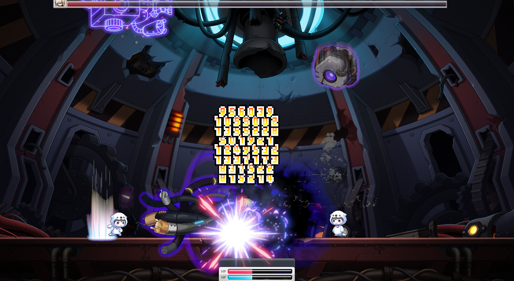

## MapleStory 모작 (서버,클라이언트)

* 제작기간 : 2024.06.01  ~ 2024.08.28

* 개발환경 : C++, DirectX11

* 시연 영상 : https://youtu.be/J0OHyz_0OKE

* DownloadLink :

* 멀티스레딩을 사용한 IOCP 게임서버 및 게임클라이언트 


<br>

## NetWork

* Accept Thread
  - 서버에 접속하는 클라이언트들을 처리해주는 Accept Thread입니다.


<details>
<summary>Accept Thread코드샘플</summary>

```c++

bool AcceptIocp::ThreadRun()
{
	if (m_pServer == nullptr)return false;
	std::shared_ptr<Packet> pack = std::make_shared<Packet>();
	SOCKADDR_IN clientaddr;
	int addlen = sizeof(clientaddr);
	SOCKET clientsock = accept(m_pServer->GetNetWork().GetSocket(), (SOCKADDR*)&clientaddr, &addlen);
	if (clientsock == SOCKET_ERROR)
	{
		int iError = WSAGetLastError();
		if (iError != WSAEWOULDBLOCK)
		{
			
			return false;
		}
	}
	else
	{

		std::shared_ptr<User> user = std::make_shared<User>(clientsock, clientaddr);
 		user->bind(m_pServer->GetIocpModel().GetIocpHandle());
		user->Recv();

		for (int iSize = 0; iSize < MAX_USER_SIZE; ++iSize)
		{
 			if (SessionMgr::GetInstance().ConnectUser(user))
			{
				break;
			}
			else
				printf("Client Connect Failed IP: %s Port:%d\n", inet_ntoa(user->GetUserAddr().sin_addr), ntohs(user->GetUserAddr().sin_port));

		}
		printf("Client Connect IP: %s Port:%d\n", inet_ntoa(user->GetUserAddr().sin_addr), ntohs(user->GetUserAddr().sin_port));

	}

	return true;
}


```
</details>


<br>

* IOCP Model
	- 비동기 I/O 작업을 마치면 큐에서 정보를 꺼내 서버에서 처리합니다.

<details>
<summary>IOCP Thread코드샘플</summary>
	
```c++
DWORD WINAPI WorkerThread(LPVOID param)
{
	DWORD dwTransfer;
	ULONG_PTR KeyValue;
	OVERLAPPED* overlap;
	IocpModel* iocp = (IocpModel*)param;
	
	while (1)
	{
		if (WaitForSingleObject(iocp->GetKillEvent(), 0) == WAIT_OBJECT_0)
		{
			break;
		}
		BOOL bRet = GetQueuedCompletionStatus(iocp->GetIocpHandle(), &dwTransfer, &KeyValue, &overlap,0);
		User* pUser = (User*)KeyValue;
		if (bRet == TRUE)
		{
			
			if (pUser != nullptr)
			{
				
				pUser->Dispatch(dwTransfer,overlap);
				
			}
		}
		else
		{
			DWORD Errmsg = GetLastError();
			if (Errmsg == WAIT_TIMEOUT)
			{

				continue;
			}
			if (Errmsg == ERROR_HANDLE_EOF)
			{

				SetEvent(iocp->GetKillEvent());
			}
			if (Errmsg == ERROR_NETNAME_DELETED)
			{
				pUser->SetConnect(false);
				continue;
			}

			SetEvent(iocp->GetKillEvent());
			
			break;
		}
	}

	return 0;

}


```
</details>

<br>

* MainThread
  - Main Thread에서는 패킷들을 BroadCast와 동시에 게임의 로직을 담당합니다.

<details>
<summary>Main Thread코드샘플</summary>

```c++
bool IOCPServer::ThreadRun()
{
	Timer::GetInstance().Frame();
	static double threadtimer=0;
	threadtimer += Timer::GetInstance().GetSecPerFrame();
	if (threadtimer <= 0.0625)
	{

		return true;
	}

	threadtimer = 0;

	for (auto& scene : ServerSceneMgr::GetInstance().GetSceneList())
	{
		scene.second->Update();
	}


	for (auto& data : m_BroadcastPacketPool.GetPacketList())
	{
		
		if (!Broadcasting(data))
		{
			
		}

		//OutputDebugString(L"send\n");
	}

	m_BroadcastPacketPool.GetPacketList().clear();

	for (std::vector<std::shared_ptr<User>>::iterator iterSend = SessionMgr::GetInstance().GetUserList().begin();
		iterSend != SessionMgr::GetInstance().GetUserList().end();)
	{
		if (*iterSend == nullptr)
		{
			iterSend++;
			continue;
		}
		std::shared_ptr<User> pUser = *iterSend;
		if (iterSend->get()->IsConnected() == false)
		{
			iterSend->get()->Close();
			iterSend = SessionMgr::GetInstance().GetUserList().erase(iterSend);
		}
		else
		{
			iterSend++;
		}

	}


	return true;
}


```
</details>


<br>

* ObjectPool Pattern
   - 잦은 생성 파괴로인한 성능 저하를 방지하기 위하여 메모리를 재사용 하도록 만들었습니다.
     
<details>
<summary>ObjectPool Pattern 코드샘플</summary>

```c++

template<typename T>
class ObjectPool
{

public:
	enum
	{
		POOL_MAX_SIZE = 1024,
		POOL_SIZE_MASK = POOL_MAX_SIZE - 1,
	};

public:
	//오브젝트 풀링을 위한 연산자 오버로딩
	
	static void* operator new(size_t size)
	{
		//여러 스레드에서 접근하는것을 방지하기 위해 사용하는 매크로임 
		//원자적 동작은 경쟁 상태(race condition)를 방지
		long long pos = InterlockedIncrement64(&m_HeadPos) - 1;
		//and 연산을 사용하여 현재 헤드의 위치값을 가져옴
		long long insert = pos & POOL_SIZE_MASK;
		// insert = 0 & 7
		// insert = 0000 0000 & 0000 0111
		// insert = 0000 0000 (결과: 0)
		void* value = InterlockedExchangePointer(&m_pool[insert], nullptr);
		
		if (value != nullptr)
		{
			return value;
		}

		//16바이트 정렬방식으로 메모리를 할당
  		return _aligned_malloc(size, MEMORY_ALLOCATION_ALIGNMENT);
	
	}

	static void operator delete(void* obj)
	{
		long long pos = InterlockedIncrement64(&m_TailPos) - 1;
		long long insert = pos & POOL_SIZE_MASK;
		void* value = InterlockedExchangePointer(&m_pool[insert], obj);
		if (value != nullptr)
		{
			_aligned_free(value);
		}
	
	}
	static void AllFree()
	{
		for (int iSize = 0; iSize < POOL_MAX_SIZE; ++iSize)
		{
			void* value = InterlockedExchangePointer(m_pool[iSize], nullptr);
			if (value != nullptr)
			{
				_aligned_free(value);
			}
		}
	}


private:
	static void* volatile m_pool[POOL_MAX_SIZE];
	static long long volatile m_HeadPos;
	static long long volatile m_TailPos;


};

//초기화
template <typename T>
void* volatile ObjectPool<T>::m_pool[POOL_MAX_SIZE] = {};

template <typename T>
long long volatile ObjectPool<T>::m_HeadPos(0);

template <typename T>
long long volatile ObjectPool<T>::m_TailPos(0);


```
</details>


<br>

* Data Serialization 
   - 동적 할당된 값은 그대로 저장할 수 없기 때문에 데이터를 전송하기 위해 byte로 변환해서 전송해야하기 때문에 데이터를 직렬화 시켜주었습니다.
  
<details>
<summary>Data Serialization 코드샘플</summary>

```c++

Packet& Packet::operator<<(PLAYER_STATE statevalue)
{
	PutData(reinterpret_cast<char*>(&statevalue), sizeof(PLAYER_STATE));
	return *this;
}

Packet& Packet::operator>>(PLAYER_STATE& statevalue)
{
	GetData(reinterpret_cast<char*>(&statevalue), sizeof(PLAYER_STATE));
	return *this;
}


int Packet::PutData(char* pSrc, int iSrcSize)
{
	//버퍼에 공간이 없다면
	if (m_pWritePos + iSrcSize > m_pEndPos)
		return 0;
	
	memcpy(m_pWritePos, pSrc, iSrcSize);
	m_pWritePos += iSrcSize;

	m_iDataSize += iSrcSize;

	return iSrcSize;
}

int Packet::GetData(char* pScr, int iSrcSize)
{
	if (iSrcSize > m_iDataSize)
		return 0;
	
	memcpy(pScr, m_pReadPos, iSrcSize);
	m_pReadPos += iSrcSize;
	m_iDataSize -= iSrcSize;

	return iSrcSize;
}

```
</details>


<br>

* BehaviorTree
  - 모든 몬스터들의 행동패턴을 BT를 이용하여 구현했습니다.
  - 몬스터의 로직은 서버에서 전담하여 각각의 클라이언트로 데이터를 전송합니다.
  - 몬스터의 트리는 파일을 읽어 해당되는 트리로 할당하도록 팩토리 패턴을 이용하여 구현했습니다.

   
<details>
<summary>BehaviorTree코드샘플</summary>

```c++
class BehaviorTree
{
private:

	std::shared_ptr<BranchNode> m_pRootNode;
	bool isRun;
	MonsterData& m_Monster;
private:
	float m_fWaitTime;
	float m_fDieTime;
	float m_fRespawnTime;

public:
	virtual void Update() {};
	void RunTree();
	void SetRunState(bool state) { isRun = state; }
	bool GetRunState() const { return isRun; }
	std::shared_ptr<BranchNode> GetRootNode() const { return m_pRootNode; }
	void SetRootNode(std::shared_ptr<BranchNode> node) { m_pRootNode = node; };
	MonsterData& GetMonsterData() {return m_Monster;}
public:

	float GetWaitTime() const { return m_fWaitTime; };
	float GetDieTime() const { return m_fDieTime; };
	float GetRespawnTime() const { return m_fRespawnTime; };

	void SetWaitTime(float time) { m_fWaitTime = time; };
	void SetDieTime(float time) { m_fDieTime = time; };
	void SetRespawnTime(float time) { m_fRespawnTime = time; };


public:
	virtual ReturnCode ChasePlayer();
	virtual ReturnCode AttackPlayer();
	virtual ReturnCode Respon();
	virtual ReturnCode Skill1Cooldown();
	virtual ReturnCode Skill1();
	virtual ReturnCode Skill2Cooldown();
	virtual ReturnCode Skill2();
	virtual void DeathEvent() {};

public:
	virtual void Init() {};

public:
	BehaviorTree(MonsterData& Monster);
	virtual ~BehaviorTree() {};
};

```
</details>

<details>
<summary>BossBT코드샘플</summary>

```c++
#pragma once
#include"BehaviorTree.h"
class Swoo2PhaseTree :public BehaviorTree
{
private:

	float m_fSpawnTime;
	float m_f1SkillColldown;
	float m_f2SkillColldown;
public:
	virtual void Init();
	virtual void Update()override;

public:
	virtual ReturnCode ChasePlayer() override;
	virtual ReturnCode AttackPlayer() override;
	virtual ReturnCode Skill1Cooldown()override;
	virtual ReturnCode Skill1()override;
	virtual void DeathEvent() override;


public:

	Swoo2PhaseTree(MonsterData& data);
	virtual ~Swoo2PhaseTree();


};

void Swoo2PhaseTree::Init()
{
	std::shared_ptr<SelectorNode> root = std::make_shared<SelectorNode>(*this);
	SetRootNode(root);

	/// 스킬 쓸 수 있으면 스킬먼저 사용
	std::shared_ptr<SequenceNode> Skill1seq = std::make_shared<SequenceNode>(*this);
	root->PushChild(Skill1seq);
	std::shared_ptr<DecoratorNode> coolDown = std::make_shared<DecoratorNode>(*this,&BehaviorTree::Skill1Cooldown);
	Skill1seq->PushChild(coolDown);
	std::shared_ptr<ActionNode> SKill1 = std::make_shared<ActionNode>(*this, &BehaviorTree::Skill1);
	Skill1seq->PushChild(SKill1);
	

	//추격및 공격
	std::shared_ptr<SequenceNode> ChaseAndAttack = std::make_shared<SequenceNode>(*this);
	root->PushChild(ChaseAndAttack);
	std::shared_ptr<ActionNode> chase = std::make_shared<ActionNode>(*this, &BehaviorTree::ChasePlayer);
	ChaseAndAttack->PushChild(chase);
	std::shared_ptr<ActionNode> attack = std::make_shared<ActionNode>(*this, &BehaviorTree::AttackPlayer);
	ChaseAndAttack->PushChild(attack);


	GetMonsterData().GetCollisionData().SetWidth(94.0f);

	GetMonsterData().GetCollisionData().SetHeight(108.0f);
	GetMonsterData().SetIsDead(false);
	SetRespawnTime(7777.0f);
}
```
</details>

<details>
<summary>팩토리 패턴 코드샘플</summary>

```c++

std::shared_ptr<BehaviorTree> MonsterData::CreateTree(std::string treename)
{

	static std::unordered_map<std::string, std::function<std::shared_ptr<BehaviorTree>(MonsterData& data)>> factoryMap =
	{
		 {"NormalMonsterTree", [this](MonsterData& data) { return std::make_shared<NormalMonsterTree>(data); }},
		 {"FlyingMonsterTree", [this](MonsterData& data) { return std::make_shared<FlyingMonsterTree>(data); }},
		 {"Swoo1PhaseTree", [this](MonsterData& data) { return std::make_shared<Swoo1PhaseTree>(data); }},
		 {"Swoo2PhaseTree", [this](MonsterData& data) { return std::make_shared<Swoo2PhaseTree>(data); }},
		 {"Swoo3PhaseTree", [this](MonsterData& data) { return std::make_shared<Swoo3PhaseTree>(data); }}
	};

	auto it = factoryMap.find(treename);

	if (it != factoryMap.end())
	{
		return it->second(*this);
	}
	else
	{
		return std::make_shared<NormalMonsterTree>(*this);
	}

}

```
</details>

## Client

<br>

* Collision
  - 게임에서 사용하는 충돌은 Line-Point , Line - OBB , OBB-OBB 를 구현하였습니다.
    
   
<details>
<summary>Line-Point코드샘플</summary>

```c++
bool Collision::PointToLine(TVector3 point, std::shared_ptr<Line> line)
{

    //직선의 방정식
    float A = line->To.y - line->From.y;
    float B = line->From.x - line->To.x;
    float C = (line->To.x * line->From.y) - (line->From.x * line->To.y);

    float dist = std::abs(A * point.x + B * point.y + C) / std::sqrt(A * A + B * B);
    if (dist > 30 || dist < -30)
        return false;

    float minX = min(line->From.x, line->To.x);
    float maxX = max(line->From.x, line->To.x);
    float minY = min(line->From.y, line->To.y);
    float maxY = max(line->From.y, line->To.y);

    bool isWithinSegment = (point.x >= minX && point.x <= maxX) && (point.y >= minY - 50 && point.y <= maxY + 50);


    return isWithinSegment;
}
```
</details>

<br>

 
 
<details>
<summary> Line - OBB코드샘플</summary>

```c++

bool Collision::isLineIntersectingOBB(std::shared_ptr<Line> line, std::shared_ptr<Collider> coll1obb, float coefficient)
{

    // 선을 OBB의 로컬 좌표계로 변환
    TVector3 localLineStart = line->From - (coll1obb->GetTransform() - TVector3(0, coefficient, 0));
    TVector3 localLineEnd = line->To - (coll1obb->GetTransform() - TVector3(0, coefficient, 0));

    // OBB의 각 축에 대해 선의 시작점과 끝점을 투영
    float minProj = INFINITY, maxProj = -INFINITY;
    for (int i = 0; i < 2; ++i) {
        float startProj = coll1obb->GetAxis(i).Dot(localLineStart);
        float endProj = coll1obb->GetAxis(i).Dot(localLineEnd);

        float minVal = min(startProj, endProj);
        float maxVal = max(startProj, endProj);

        // 투영 결과가 OBB의 반경(extents) 내에 있는지 확인 
        if (minVal > coll1obb->GetWidth() || maxVal < -coll1obb->GetWidth()) {
            return false;
        }

        // 각 축의 투영 범위를 갱신
        minProj = min(minProj, minVal);
        maxProj = max(maxProj, maxVal);
    }

    return true;
}

```
</details>


<br>

   
   
<details>
<summary> OBB - OBB코드샘플</summary>

```c++

bool Collision::OBBCollision2D(std::shared_ptr<Collider> coll1, std::shared_ptr<Collider> coll2, TVector3 axis)
{
    float projection1 = 0;

    projection1 += std::abs((coll1->GetAxis(0).Dot(axis) * coll1->GetWidth()));
    projection1 += std::abs((coll1->GetAxis(1).Dot(axis) * coll1->GetHeight()));

    float projection2 = 0;

    projection2 += std::abs((coll2->GetAxis(0).Dot(axis) * coll2->GetWidth()));
    projection2 += std::abs((coll2->GetAxis(1).Dot(axis) * coll2->GetHeight()));

    auto a = coll1->GetTransform() - coll2->GetTransform();
    float distance = std::abs(a.Dot(axis));

    return distance <= projection1 + projection2;

}


```
</details>


## MapTool & Monster Tool
* 오브젝트 및 몬스터 배치가 가능한 맵툴을 구현하였습니다.
    

<br>

* 몬스터를 제작가능한 간단한 툴을 구현하였습니다.
    

* 파일입출력을 이용하여 제작한 맵정보와 몬스터 정보를 저장 및 불러올 수 있도록 구현하였습니다.


<details>
<summary> Save 코드샘플</summary>

```c++

bool SaveLoader::SaveData(std::shared_ptr<Scene> pSceneData, std::string SavePath)
{

	FILE* fpWrite = nullptr;

	if (fopen_s(&fpWrite, SavePath.c_str(), "w") == 0)
	{
		bool bRet = true;
		std::string header = "#MapName";
		bRet = fprintf_s(fpWrite, "%s\n", header.c_str());
		std::string path;
		auto ret = pSceneData->GetMapName().find(L"../resource");
		if (!ret)
		{
			path = wtm(pSceneData->GetMapName())+ ".png";
		}
		else
		{
			path = "../resource/MapObejct/" + wtm(pSceneData->GetMapName()) + ".png";
		}

		bRet = fprintf_s(fpWrite, "%s\n", path.c_str());

		header = "#SceneNum";
		bRet = fprintf_s(fpWrite, "%s\n", header.c_str());
		bRet = fprintf_s(fpWrite, "%d\n", pSceneData->GetSceneNum());

		header = "#LineCollider";
		bRet = fprintf_s(fpWrite, "%s\n", header.c_str());
		bRet = fprintf_s(fpWrite, "%d\n", static_cast<int>(pSceneData->GetLineColliderList().size()));
		for (auto& line : pSceneData->GetLineColliderList())
		{
			bRet = fprintf_s(fpWrite, "%d\t", line->type);
			bRet = fprintf_s(fpWrite, "%f\t", line->From.x);
			bRet = fprintf_s(fpWrite, "%f\t", line->From.y); 
			bRet = fprintf_s(fpWrite, "%f\t", line->To.x);
			bRet = fprintf_s(fpWrite, "%f\n", line->To.y);
		}

		header = "#ObjectList";
		bRet = fprintf_s(fpWrite, "%s\n", header.c_str());
		bRet = fprintf_s(fpWrite, "%d\n", static_cast<int>(pSceneData->GetObjectList().size()- pSceneData->GetPotalList().size()));
		for (auto& obj : pSceneData->GetObjectList())
		{
			if (obj->GetObjectType() == ObejctType::Defalut)
			{
				std::string path = "../resource/MapObejct/" + wtm(obj->GetTexture()->GetName());
				bRet = fprintf_s(fpWrite, "%s\n", path.c_str());

				bRet = fprintf_s(fpWrite, "%d\t", obj->GetObjectType());
				bRet = fprintf_s(fpWrite, "%f\t", obj->GetTransform().x);
				bRet = fprintf_s(fpWrite, "%f\t", obj->GetTransform().y);
				bRet = fprintf_s(fpWrite, "%d\t", obj->GetSpriteInfo()->iCol);
				bRet = fprintf_s(fpWrite, "%d\t", obj->GetSpriteInfo()->iRow);
				bRet = fprintf_s(fpWrite, "%d\t", obj->GetSpriteInfo()->iMaxImageCount);
				bRet = fprintf_s(fpWrite, "%lf\n", obj->GetSpriteInfo()->m_fDelay);
			}

		}

		header = "#MonsterList";
		bRet = fprintf_s(fpWrite, "%s\n", header.c_str());
		bRet = fprintf_s(fpWrite, "%d\n", static_cast<int>(pSceneData->GetMonsterList().size()));
		for (auto& obj : pSceneData->GetMonsterList())
		{

			std::string path = "../resource/MonsterData/" + obj->GetMonsterName() + ".txt";
			bRet = fprintf_s(fpWrite, "%s\n", path.c_str());
			path = obj->GetTreeName();
			bRet = fprintf_s(fpWrite, "%s\n", path.c_str());
			bRet = fprintf_s(fpWrite, "%f\t", obj->GetTransform().x);
			bRet = fprintf_s(fpWrite, "%f\n", obj->GetTransform().y);


		}

		header = "#PotalList";
		bRet = fprintf_s(fpWrite, "%s\n", header.c_str());
		bRet = fprintf_s(fpWrite, "%d\n", static_cast<int>(pSceneData->GetPotalList().size()));
		for (auto& obj : pSceneData->GetPotalList())
		{
			if (obj->GetObjectType() == ObejctType::Portal)
			{
				std::string path = "../resource/MapObejct/" + wtm(obj->GetTexture()->GetName());
				bRet = fprintf_s(fpWrite, "%s\n", path.c_str());
				bRet = fprintf_s(fpWrite, "%d\t", obj->GetNextSceneNum());
				bRet = fprintf_s(fpWrite, "%d\t", obj->GetObjectType());
				bRet = fprintf_s(fpWrite, "%f\t", obj->GetTransform().x);
				bRet = fprintf_s(fpWrite, "%f\t", obj->GetTransform().y);
				bRet = fprintf_s(fpWrite, "%d\t", obj->GetSpriteInfo()->iCol);
				bRet = fprintf_s(fpWrite, "%d\t", obj->GetSpriteInfo()->iRow);
				bRet = fprintf_s(fpWrite, "%d\t", obj->GetSpriteInfo()->iMaxImageCount);
				bRet = fprintf_s(fpWrite, "%lf\n", obj->GetSpriteInfo()->m_fDelay);
			}

		}
		fclose(fpWrite);
	}


	return false;
}


```
</details>

<br>

<details>
<summary> Load 코드샘플</summary>

```c++

bool SaveLoader::LoadData(std::shared_ptr<Scene> pSceneData, std::string LoadPath)
{
	FILE* fpRead = nullptr;

	if (fopen_s(&fpRead, LoadPath.c_str(), "rt") == 0)
	{

		TCHAR buffer[256] = { 0, };

		while (_fgetts(buffer, _countof(buffer), fpRead) != 0)
		{
			TCHAR type[36] = { 0, };

			_stscanf_s(buffer, _T("%s"), type, (unsigned int)_countof(type));

			if (_tcscmp(type, L"#MapName") == 0)
			{

				TCHAR tex[80] = { 0, };
				_fgetts(buffer, _countof(buffer), fpRead);
				_stscanf_s(buffer, _T("%s\n"), tex, (unsigned int)_countof(tex));

				pSceneData->ResetMap(tex);
				pSceneData->GetMap()->SetScale({ static_cast<float>(pSceneData->GetMap()->GetTexture()->GetWidth()),
												 static_cast<float>(pSceneData->GetMap()->GetTexture()->GetHeight()),0});
			}
			else if (_tcscmp(type, L"#SceneNum") == 0)
			{
				_fgetts(buffer, _countof(buffer), fpRead);
				int Num = 0;
				_stscanf_s(buffer, _T("%d"), &Num);
				pSceneData->SetSceneNum(Num);

			}
			else if (_tcscmp(type, L"#LineCollider") == 0)
			{
				pSceneData->ClearLineList();
				_fgetts(buffer, _countof(buffer), fpRead);
				int iSize = 0;
				_stscanf_s(buffer, _T("%d"), &iSize);
				std::vector<PNCT_VERTEX> v;
				for (int i = 0; i < iSize; i++)
				{
					_fgetts(buffer, _countof(buffer), fpRead);
					std::shared_ptr<Line> line = std::make_shared<Line>();
					_stscanf_s(buffer, _T("%d %f %f %f %f \n"), &line->type ,&line->From.x, &line->From.y, &line->To.x, &line->To.y);
					v.push_back({});
					v[v.size()-1].Pos = line->From;
					v.push_back({});
					v[v.size() - 1].Pos = line->To;
					
					pSceneData->PushLineCollider(line);
				}
				v.push_back({});
				pSceneData->GetCollider()->SetVertexList(v);
				auto& vb = pSceneData->GetCollider()->GetVertexBuffer();
				auto& vl = pSceneData->GetCollider()->GetVertexList();

				Device::GetContext()->UpdateSubresource(vb.Get(), 0, 0, &vl.at(0), 0, 0);
			}
			else if (_tcscmp(type, L"#ObjectList") == 0)
			{
				pSceneData->ClearObjectList();
				_fgetts(buffer, _countof(buffer), fpRead);
				int iSize = 0;
				_stscanf_s(buffer, _T("%d"), &iSize);
				
				for (int i = 0; i < iSize; ++i)
				{
					std::shared_ptr<SpriteObject> obj = std::make_shared<SpriteObject>();
					std::shared_ptr<SpriteData> data = std::make_shared<SpriteData>();
					TCHAR tex[80] = { 0, };
					_fgetts(buffer, _countof(buffer), fpRead);
					_stscanf_s(buffer, _T("%s\n"), tex, (unsigned int)_countof(tex));
					obj->Init();
					obj->Create(tex, L"../Shader/Defalutshader.hlsl");

					int objectType;
					TVector3 temp;
					_fgetts(buffer, _countof(buffer), fpRead);
					_stscanf_s(buffer, _T("%d %f %f %d %d %d %lf \n"), &objectType,&temp.x, &temp.y, &data->iCol, &data->iRow, &data->iMaxImageCount, &data->m_fDelay);
					obj->SetObejctType((ObejctType)objectType);
					obj->SetTransform(temp);
					obj->SetSpriteInfo(data);

				
					obj->SetUVData(data->m_UVList, data->iRow,data->iCol);
					obj->GetSpriteInfo()->m_vScale = { static_cast<float>(obj->GetTexture()->GetWidth() / data->iCol),
													   static_cast<float>(obj->GetTexture()->GetHeight() / data->iRow),1 };

					obj->SetScale(data->m_vScale);
					obj->GetCollider()->SetTransform(obj->GetTransform());
					obj->GetCollider()->SetScale(data->m_vScale);
					obj->GetCollider()->Create(L" ", L"../Shader/LineDebug.hlsl");

					pSceneData->PushObject(obj);
				}
				
			
			}
			else if (_tcscmp(type, L"#MonsterList") == 0)
			{
				pSceneData->ClearMonsterList();
				_fgetts(buffer, _countof(buffer), fpRead);
				int iSize = 0;
				_stscanf_s(buffer, _T("%d"), &iSize);

				for (int i = 0; i < iSize; ++i)
				{
					std::shared_ptr<MonsterObject> obj = std::make_shared<MonsterObject>();
					TCHAR tex[80] = { 0, };
					_fgetts(buffer, _countof(buffer), fpRead);
					_stscanf_s(buffer, _T("%s\n"), tex, (unsigned int)_countof(tex));
					LoadMonsterData(obj, wtm(tex));

					_fgetts(buffer, _countof(buffer), fpRead);
					_stscanf_s(buffer, _T("%s\n"), tex, (unsigned int)_countof(tex));
					obj->SetTreeName(wtm(tex));


					int hp = 0;
					_fgetts(buffer, _countof(buffer), fpRead);
					_stscanf_s(buffer, _T("%d\n"), &hp);


					_fgetts(buffer, _countof(buffer), fpRead);
					float tempx;
					float tempy;
					_stscanf_s(buffer, _T("%f %f \n"), &tempx, &tempy);
					obj->SetTransform({ tempx,tempy,0 });
					obj->GetCollider()->SetTransform({ tempx,tempy,0 });
					pSceneData->PushMonster(obj);
				}


			}
			else if (_tcscmp(type, L"#PotalList") == 0)
			{
				pSceneData->ClearPotalList();
				_fgetts(buffer, _countof(buffer), fpRead);
				int iSize = 0;
				_stscanf_s(buffer, _T("%d"), &iSize);

				for (int i = 0; i < iSize; ++i)
				{
					std::shared_ptr<SpriteObject> obj = std::make_shared<PotalObject>();
					std::shared_ptr<SpriteData> data = std::make_shared<SpriteData>();
					TCHAR tex[80] = { 0, };
					_fgetts(buffer, _countof(buffer), fpRead);
					_stscanf_s(buffer, _T("%s\n"), tex, (unsigned int)_countof(tex));
					obj->Init();
					obj->Create(tex, L"../Shader/Defalutshader.hlsl");

					int nextSceneNum;
					int objectType;
					TVector3 temp;
					_fgetts(buffer, _countof(buffer), fpRead);
					_stscanf_s(buffer, _T("%d %d %f %f %d %d %d %lf \n"), &nextSceneNum ,&objectType, &temp.x, &temp.y, &data->iCol, &data->iRow, &data->iMaxImageCount, &data->m_fDelay);
					obj->SetNextSceneNum(nextSceneNum);
					obj->SetObejctType((ObejctType)objectType);
					obj->SetTransform(temp);
					obj->SetSpriteInfo(data);


					obj->SetUVData(data->m_UVList, data->iRow, data->iCol);
					obj->GetSpriteInfo()->m_vScale = { static_cast<float>(obj->GetTexture()->GetWidth() / data->iCol),
													   static_cast<float>(obj->GetTexture()->GetHeight() / data->iRow),1 };

					obj->SetScale(data->m_vScale);

					obj->SetScale(data->m_vScale);
					obj->GetCollider()->SetTransform(obj->GetTransform());
					obj->GetCollider()->SetScale(data->m_vScale);
					obj->GetCollider()->Create(L" ", L"../Shader/LineDebug.hlsl");
					pSceneData->PushObject(obj);
					pSceneData->PushPotalObject(obj);
				}


			}


		}
		fclose(fpRead);
	}


	return false;
}

```
</details>


